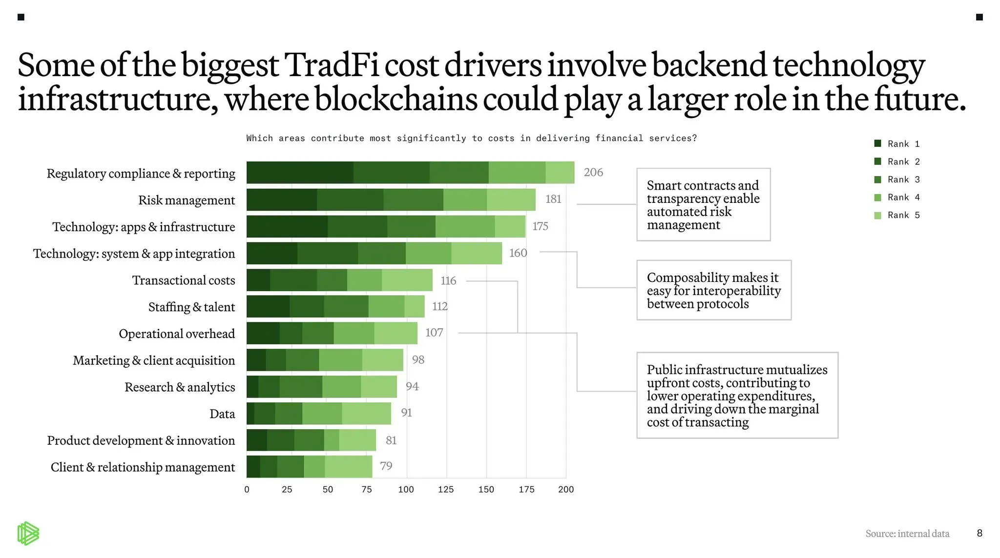
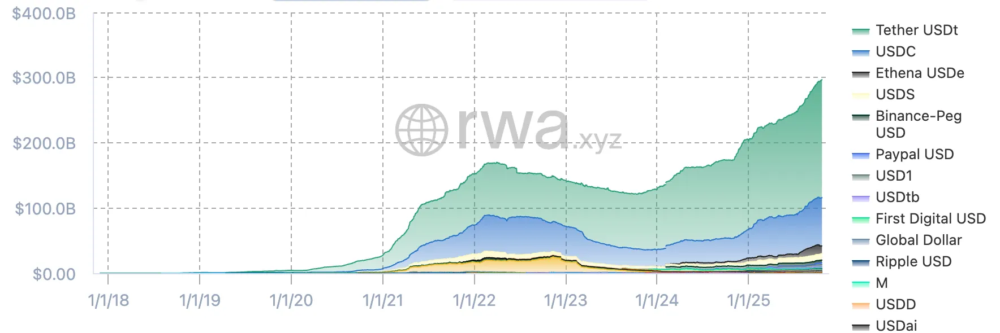

# What is Cork?

**TL;DR**\
Cork introduces a new primitive for tokenized risk, serving as a programmable risk layer for onchain assets such as vault tokens, yield-bearing stablecoins, and liquid (re)staking tokens. Cork’s core primitive enables asset managers and issuers to spin up custom swap markets that enhance redemption liquidity, risk transparency, and market confidence for their onchain assets. Backed by a16z crypto, OrangeDAO, Road Capital, BitGo, G-20, and Steakhouse Financial, Cork is building the risk infrastructure needed to bring institutional capital into onchain credit markets.

***

### Why Tokenized Risk?

Risk management has always been one of finance’s most important inventions. The ability to pool and distribute risk was foundational to the rise of modern economies, whether through maritime insurance, fire policies, or early life annuities.

When 17th-century mathematicians formalized probability theory, they transformed uncertainty into something measurable. Insurers could price risk and investors could underwrite it. In effect, risk became an asset class.

That shift powered centuries of industrial and financial growth. It made corporate investment possible, allowed global trade to flourish, and gave individuals the confidence to borrow, build, and own property.

Today, our economies are digitizing at every layer. Just as insurance once turned chance into a market, tokenization now turns markets into software. It’s time risk management evolved with it.

### The Growing Need for Risk Tokenization

As onchain adoption accelerates and institutional capital enters the space, **risk infrastructure is emerging as a foundational pillar** for the next phase of crypto’s growth. There is clear commitment from banks and asset managers to leverage public blockchains to reduce costs and increase efficiency. Today, risk management is one of the top cost drivers for these institutions to deliver financial services to end customers (source: Paradigm).

<figure><figcaption></figcaption></figure>

There is also growing institutional demand for risk-managed DeFi exposure, particularly around stablecoins & onchain yield products. This is evident as the stablecoin market has more than doubled since early 2024, from $130 billion to over $300 billion, while tokenized real-world assets have surged from $1 billion in 2021 to $35 billion today (source: RWA.xyz). In 2025, tokenization entered mainstream finance: Nasdaq approved trading of tokenized stocks and ETFs, and Robinhood launched tokenized U.S. equities for European clients, alongside a wave of similar institutional initiatives.

<figure><figcaption></figcaption></figure>

Yet even as billions flow into DeFi, robust tools for identifying, pricing, and transferring risk remain underdeveloped.

The Terra–Luna failure didn’t just vaporize >$40B—it set off a credit contagion that blew up some of the largest institutions in crypto. The episode underscored how the hidden leverage and credit risk can adversely affect the entire ecosystem.

More recently, we have seen the largest liquidation event in history on **crypto’s “Black Friday,” October 10, 2025, when multiple pegged assets traded below their peg on certain centralized venues.** As long as DeFi users remain hungry for yield, this problem will not go away on its own. The oracle configuration problem, whether pegged assets should be hardcoded 1:1, reliant on PoR, or reliant on market prices, is just one aspect to the problem. **Even a perfect oracle solution does not account for the duration component that is inherent to most yield-bearing pegged assets.** If this duration risk is not acknowledged, it won’t be long before DeFi users are once again reminded that there is no such thing as a free lunch.

For institutional players to meaningfully participate in DeFi and for the tokenization of RWAs, credit, and stablecoins to scale, **onchain finance needs institutional-grade risk primitives**—programmable, transparent, and composable.

### The Future of Risk

**Cork serves as that missing primitive.** It is a risk infrastructure toolkit built for onchain finance.

With Cork, market participants can price, hedge, and trade a wide array of onchain risks, from slashing and default risks, impacts of slippage and depegs.

By filling the current infrastructure gap, Cork helps make asset tokenization viable for a broader range of institutional users, turning risk from a barrier into a design space for innovation.

We’re building the **programmable risk layer** for public blockchains: a set of **composable, transparent, and auditable primitives** that let markets **price, hedge, and trade** asset‑specific risk on demand.

Our commitment is simple: **make onchain risk explicit & tradable.** By standardizing how risk is represented and cleared on public chains, Cork unlocks resilient pegs, sturdier credit, and investable yield at **institutional scale**.
