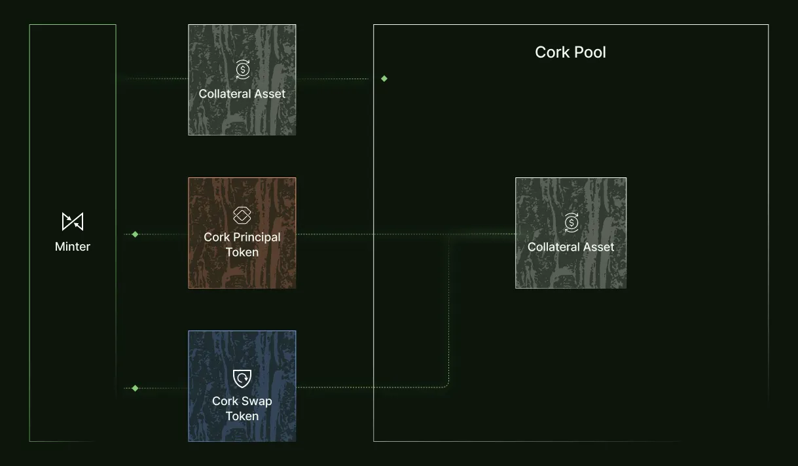

# Cork Pool

The foundational component of Cork Protocol is the `Cork Pool`, which is the mechanism around which our markets are built. It works as follows.

Each Cork Pool is built around an asset pair:

`Collateral Asset` or `CA` serves as collateral which swaps can be exercised against. It typically refers to highly liquid, low risk and well-established assets, such as Ether, USDC, or DAI. To improve capital efficiency it may also include derivatives or yield-bearing assets like sDAI or stETH.

`Reference Asset` or `REF` is designed to track or maintain parity with the Collateral Asset. The Reference Asset will generally have a different liquidity or risk profile, and may at times deviate in price from the Collateral Asset.

The Cork Pool can receive deposits of Collateral Asset where it is locked and mint two tokens that are returned to the depositor:

`Cork Principal Token` or `cPT`: Holders of the Cork Principal Token take on the potential risk in exchange for the opportunity to earn a “risk premium" by selling their Cork Swap Tokens. These investors are exposed to the possibility that the Reference Asset will lose value relative to the Collateral Asset but stand to benefit if swaps are not exercised.

`Cork Swap Token` or `cST` which is a swap token that allow a user to before it’s expiry make the following exchange:

$$
Cork\ Swap \ Token + Reference\ Asset = Collateral\ Asset
$$

The holder of the Cork Swap Token stands to profit in a potential liquidity crisis and can use the exposure to fully hedge the risk of a Reference Asset position.

Furthermore, the Cork Principal Token + Cork Swap Token can before the expiry always be converted back to the Collateral Asset 1:1.

$$
Cork \ Principal\ Token + Cork\ Swap \ Token = Collateral\ Asset
$$

**Mint Mechanism**: The Collateral Asset is deposited and used to mint the Cork Principal Token and Cork Swap Token that is returned to depositor. In the below diagram the flow can be seen with Eth as the Collateral Asset.

<figure><figcaption></figcaption></figure>

#### **Exchange Rate**

Most assets relevant to Cork accrue yield into the token value, for example Lido steth is a rebasing token but most of the liquidity and DeFi integrations for steth are in wsteth which trades at 1.17 eth per wsteth. To address this, there is an `Exchange Rate` in the Cork Pool. The Exchange Rate determines how many Reference Assets you need to deposit to receive a Collateral Asset. The higher the Exchange Rate, the fewer Reference Assets need to be deposited.

For example in the above wsteth example it would compute as follows:

$$
\text{Mint} \\ 1\ eth = 1\ Cork\ Principal\ Token + 1\ Cork\ Swap\ Token
$$

$$
\text{Exercise Swap} \\ 1\ Cork\ Swap \ Token + 0.854\ wsteth = 1\ eth
$$

In the case the Collateral Asset is accruing yield in excess of the Reference Asset, the Exchange Rate is continuously decreased in accordance with the differential yield generated by the Collateral Asset and the Reference Asset. This is important to protect Cork Principal Token holders such that their yield continues to accrue in the Cork Pool, without updating the Exchange Rate accrued yield could be arbitraged out by exercising swaps. For example if the Collateral Asset is accruing 10% APY, the Exchange Rate should decrease by 10% per year (which means you need to deposit a larger quantity of Reference Assets to exercise the swap). However, if the Reference Asset accrues 6% APY the differential is only 4%, which means over the course of a year the Exchange Rate would only decline 4%.&#x20;

## Exercise Swap Mechanism

A user can exercise their Cork Swap Token by depositing 1 Reference Asset + 1 Cork Swap Token to receive 1 Collateral Asset from the Cork Pool (minus an exercise fee). This means holding a Cork Swap Token enables you to redeem the Collateral Asset at a 1:1 relationship with the Reference Asset.

<figure><figcaption></figcaption></figure>

In the presence of a Cork Swap Token the Reference Asset inherits the liquidity of the Collateral Asset, since they can always be swapped 1:1. This has huge implications for the risk profile of the Reference Asset as collateral (eg in lending markets) since the Collateral Asset often has orders of magnitude more liquidity than the Reference Asset. Let's take a bridge as an example. Agglayer's Vault Bridge rehypothecates bridge collateral by depositing it into Morpho Vaults, which use this collateral to back loans. Due to the typically high utilization rates of these Morpho Vaults (often \~90%), the amount of collateral immediately available for withdrawals is limited. For example, at 90% utilization, only 10% of the bridge collateral can be simultaneously withdrawn. This means that if a large number of users want to bridge back to Ethereum mainnet at any given time, there will not be enough liquidity available to service those redemptions from the vault. The Cork Pool enables vaults to offer early redemptions without compromising capital efficiency or user experience. Liquidity providers deposit liquid assets (e.g., stETH, sUSDS) into a Cork Pool, allowing bridge operators to purchase fully-collateralized Cork Swap Tokens that guarantee liquidity to meet user redemptions in any market conditions. In return, LPs earn native yield plus a risk premium—while bridge managers benefit from a redemption buffer that maintains user confidence in black swan scenarios.

Cork Swap Tokens change the liquidity risk profile for larger investors since with the available liquidity on many Reference Assets it is difficult to immediately liquidate big positions. For such users, the immediate liquidity guarantee from Cork Swap Tokens is another use case and form of utility for the token beyond the hedge. This is particularly useful to manage duration mismatch risks, which is a common challenge for vaults.

If the Reference Asset loses value relative to the Collateral Asset, holders of the Cork Swap Token can profit by exercising and receiving the Collateral Asset from the Cork Pool. The value of the Cork Swap Token is therefore related to the CA:REF relative price and implied risk of the Reference Asset. The Cork Swap Token becomes a market to price the risk of the Reference Asset.

For example in an LRT-ETH pair, if the Reference Asset falls to 0.8 ETH, the Cork Swap Token will then be worth at least 0.2 ETH. If an investor bought the Cork Swap Token for 0.01 ETH, the position is now worth 0.2 ETH — a 20x return on the cST. This illustrates the leveraged exposure inherent in the Cork Swap Token: limited downside (the premium paid) with asymmetric upside when the Reference Asset loses value.

#### **Repurchase Mechanism**

When the Cork Pool receives Reference Asset + Cork Swap Token tokens during periods of swaps being exercised, these assets can be repurchased to facilitate potential arbitrage. The Reference Asset Repurchase Mechanism allows you to repurchase the Reference Asset + Cork Swap Token with the original amount of Collateral Asset (minus a fee that linearly decreases with time to expiry). The exchange is as follows:

$$
cST + REF = CA + \text{fee}
$$

There are two scenarios where one would do this. If the price of Cork Principal Token < Reference Asset, then both the Reference Asset and Cork Swap Token can be sold to Collateral Asset for a profit. Alternative if the price of Cork Swap Token + Reference Asset > Collateral Asset, then these are sold to Collateral Asset for a profit. Arbitrage bots will automatically execute such trades to keep the Cork Swap Token and Cork Principal Token in line with the Reference Asset price.

**How to treat the Reference Asset in the Cork Pool**

When swaps are exercised, some Collateral Asset is replaced by Cork Swap Token + Reference Asset. In a scenario where the Reference Asset returns to its usual liquidity profile, the Cork Pool will be restored to holding just Collateral Asset through the Repurchase Mechanism. If that does not happen, the Reference Asset is held in the Cork Pool to be redeemed at expiry by Cork Principal Token holders.

Take a scenario where the Reference Asset temporarily loses value relative to the Collateral Asset — the Repurchase mechanism can generate profit. For example, in an LRT:ETH pair trading 1:1, with cST priced at 0.02 ETH: if the LRT falls to 0.9 ETH, the cST might trade at 0.13 ETH as the market prices in further risk. At this point, spending 1 ETH to repurchase REF + cST from the pool (even with a fee) is profitable because the combined value of REF + cST exceeds 1 ETH. Any time there is a temporary price deviation and recovery, there is likely a profit to be made through the Repurchase mechanism.
