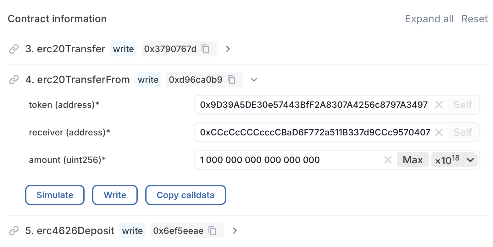

# Mint Tokens (without dApp or Batch-Capable Wallet)

Provide cover by depositing [**collateral assets**](../../core-concepts/collateral-asset.md) into a [**Cork Pool**](../../core-concepts/cork-pool.md) to mint shares of Cork [**Principal Token**](../../core-concepts/principal-token.md) (cPT) and Cork [**Swap Token**](../../core-concepts/swap-token.md) (cST), without using our dApp.

This **"Mint" operation** on Cork:

* deposits [**Collateral Asset**](../../core-concepts/collateral-asset.md) into one of many [**Cork Pools**](../../core-concepts/cork-pool.md)
* mints share tokens (i.e. increases the circulating supply of cPT & cST tokens of that Cork Pool)

***

## **How to Mint Shares of a Cork Pool via an Escrowed Deposit**


You will be performing a trust-minimized escrowed operation. This is enforced by our escrow smart contract (CorkAdapter) to ensure that the end-user's desired intent is fulfilled properly with the expected outcomes. A deadline also ensures that your tokens are never stuck in an inconsistent state.


**Prerequisites:**

* The Cork Pool's market id (bytes32).
  * A balance of [**Collateral Asset**](../../core-concepts/collateral-asset.md) **(CA)** that pertains to this [**Cork Pool**](../../core-concepts/cork-pool.md).
* An EOA or legacy wallet that does not support _atomic batching —_ i.e. _**not** an_ [EIP-5792](https://www.eip5792.xyz/introduction) capable wallet such as a SAFE Wallet or an Account-Abstraction Wallet.
  * For your own safety, you are advised to use a wallet that supports clear signing (i.e. some form of calldata and bundle visualization) that improves opsec.
* Completed a due diligence audit of the `safeDeposit` function on `Line 126` of the escrow manager contract (CorkAdapter) at its live deployment address via either:
  * **Sourcify.dev:** [https://repo.sourcify.dev/1/0xCCcCcCCCcccCBaD6F772a511B337d9CCc9570407](https://repo.sourcify.dev/1/0xCCcCcCCCcccCBaD6F772a511B337d9CCc9570407)
  * **Blockscout:** [https://eth.blockscout.com/address/0xCCcCcCCCcccCBaD6F772a511B337d9CCc9570407?tab=contract\_source\_code](https://eth.blockscout.com/address/0xCCcCcCCCcccCBaD6F772a511B337d9CCc9570407?tab=contract_source_code)
  * **Github:** [Link](https://github.com/Cork-Technology/phoenix/blob/d8d469b0189184179f64ab6e4410b1cda8fcace4/contracts/periphery/CorkAdapter.sol#L126-L168)

***


These instructions are for wallets that do not support atomic batch transactions. If you have an _atomic_ EIP-5792 capable wallet such as SAFE Wallet by safe.global (previously Gnosis SAFE), it is recommended to use [this guide](mint-tokens-without-dapp.md) instead, as it requires fewer steps and saves gas.


### Step 1: Open your Chain Explorer's Transaction Builder

Before we begin, check that you’re using the latest version of your browser by visiting [whatismybrowser.com](https://www.whatismybrowser.com/). If it’s not up to date, please update your browser to the latest version before continuing.

Connect your wallet to a Blockchain Explorer's Transaction Builder through this link: [https://eth.blockscout.com/token/0x9D39A5DE30e57443BfF2A8307A4256c8797A3497?tab=write\_contract](https://eth.blockscout.com/token/0x9D39A5DE30e57443BfF2A8307A4256c8797A3497?tab=write_contract)

<figure><figcaption>
Press [Connect Wallet]
</figcaption></figure>

<figure><figcaption>
Ensure that the right wallet address is connected
</figcaption></figure>

***

### Step 2: Perform Transaction #1 – Allow spending of Collateral Assets by the Escrow Contract

Perform the 1st transaction to allow spending of collateral assets by our trust-minimized escrow manager contract (CorkAdapter):

* **Contract Address:** `<ERC20 token address of Collateral Asset>`
* **Contract Method:** `approve`
  * **spender (escrow address):** `0xCCcCcCCCcccCBaD6F772a511B337d9CCc9570407`&#x20;
  * **amount (of collateral):** \<wei amount of collateral asset to deposit, or allowance amount in wei>

How to obtain ERC20 token address of Collateral Asset

The [Collateral asset](../../core-concepts/collateral-asset.md) (CA) address and [Reference asset](../../core-concepts/reference-asset.md) (REF) address may be obtained by calling `CorkPoolManager.assets(poolId)` with the [Cork Pool](../../core-concepts/cork-pool.md) id, via either:

* **Etherscan (Closed source):** [**Link**](https://etherscan.io/address/0xccCCcCcCCccCfAE2Ee43F0E727A8c2969d74B9eC#readProxyContract#F4)
* **Blockscout (Open source):** [**Link**](https://eth.blockscout.com/address/0xccCCcCcCCccCfAE2Ee43F0E727A8c2969d74B9eC?tab=read_proxy\&source_address=0x1cCccCccCcCf9A60Fe57cd7CEf504d1DaaA78244#0x9fda5b66)
* **Foundry Command Line:**
  * `cast call`\
    `0xccCCcCcCCccCfAE2Ee43F0E727A8c2969d74B9eC`\
    `"assets(bytes32)(address collateralAsset, address referenceAsset)"`\
    `<POOL_ID>`\
    `--rpc-url https://eth.drpc.org`

By following these instructions:



### Calculate the allowed amount in wei

To calculate the right wei-amount of collateral asset (CA), first obtain the token decimals of the collateral asset from its ERC20 contract address, then multiply your amount by 10^(erc20\_decimal\_of\_CA).

For example, 10 USDC (which has 6 decimals) is represented as $$10 \times 10^{6}$$ , which is `10 000 000` in wei-amount.

Use a unit converter that allows you to adjust the token decimals, such as: \
[https://converter.swiss-knife.xyz/eth](https://converter.swiss-knife.xyz/eth?wei=1000000000000000000)

<figure><figcaption>
Input the amount under "Ether", adjust the decimals of "10^6", then press [Copy] button to its right.
</figcaption></figure>



### Enter ERC20 Address of Collateral Asset

Press the search button on the top-right of the Blockchain Explorer page and input the Collateral Asset's ERC20 address as shown below.

* **Search by address:** `<ERC20 token address of Collateral Asset>`

<figure><figcaption>
Search for ERC20 token address &#x26; Select the first result
</figcaption></figure>



### Input Transaction #1 Details

Press \[Contract], then \[Read/Write contract], then \[Write].

Then scroll down to look for `approve` , expand the section, and input these details:

* **Contract Method:** `approve`
* **spender (address):** `0xCCcCcCCCcccCBaD6F772a511B337d9CCc9570407`&#x20;
* **amount (uint256):** \<allowance amount in wei, copied from above>

<figure><figcaption>
Input transaction details under the contract method
</figcaption></figure>



### Sign and Submit Transaction #1

Unlock your connected wallet, and press **\[Write]**, then review and sign transaction #1 on your connected wallet.

<figure><figcaption>
Press [Confirm]
</figcaption></figure>

<figure><figcaption>
Wait for the transaction to complete
</figcaption></figure>

<figure><figcaption>
Close this popup
</figcaption></figure>



***

### Step 3: Perform Transaction #2 – Deposit/Mint with escrowed assets

Perform the 2nd transaction to mint cPT (Cork [Principal Token](../../core-concepts/principal-token.md)) and cST (Cork [Swap Token](../../core-concepts/swap-token.md)) by depositing escrowed collateral assets into a Cork Pool:

* **Contract Address:** `0x6566194141eefa99Af43Bb5Aa71460Ca2Dc90245`&#x20;
* **Contract Method:** `multicall`&#x20;
  * **Send native ETH:** `0`
  * **bundle:**
    * **#1 Call** (tuple):
      * **to** (address): `0xCCcCcCCCcccCBaD6F772a511B337d9CCc9570407`
        * The `to` address is the call target, which is the escrow contract address
      * **data** (bytes):
        * The `calldata` as copied from the [erc20TransferFrom step](mint-tokens-without-dapp-or-batch-capable-wallet.md#input-erc20transferfrom-parameters).
      * **value** (uint256): `0`
        * The `value` is the wei amount of ETH or native token to forward. Set to 0 (none) in this case.
      * **skipRevert** (bool): `false`,
        * If `skipRevert` is true, other planned calls will continue executing even if this call reverts. To reduce gas wastage, we must revert if the ERC20 transfer-to-escrow fails.
      * **callbackHash** (bytes32): `0x0000000000000000000000000000000000000000000000000000000000000000`
        * The `callbackHash` should be set to the hash of the reenter bundle data. Set to 0x0 (none) in this case.
    * **#2 Call** (tuple):
      * **to** (address): `0xCCcCcCCCcccCBaD6F772a511B337d9CCc9570407`
        * The `to` address is the call target, which is the escrow contract address
      * **data** (bytes):
        * The `calldata` as copied from the [safeDeposit step](mint-tokens-without-dapp-or-batch-capable-wallet.md#input-safedeposit-parameters).
      * **value** (uint256): `0`
        * The `value` is the wei amount of ETH or native token to forward. Set to 0 (none) in this case.
      * **skipRevert** (bool): `false`,
        * If `skipRevert` is true, other planned calls will continue executing even if this call reverts. To protect escrowed funds, we must also revert the ERC20 transfer-to-escrow if the deposit fails.
      * **callbackHash** (bytes32): `0x0000000000000000000000000000000000000000000000000000000000000000`
        * The `callbackHash` should be set to the hash of the reenter bundle data. Set to 0x0 (none) in this case.

By following these instructions:



### Input Erc20TransferFrom Parameters

Input these parameters into the "erc20TransferFrom" form linked [here](https://eth.blockscout.com/address/0xCCcCcCCCcccCBaD6F772a511B337d9CCc9570407?tab=write_contract#0xd96ca0b9):

* **Contract Method:** `erc20TransferFrom`&#x20;
  * **params:**
    * **token** (address):
      * ERC20 token address of Collateral Asset
    * **receiver** (address)
      * The escrow contract address: `0xCCcCcCCCcccCBaD6F772a511B337d9CCc9570407`
    * **amount** (uint256)
      * The wei amount of collateral assets to deposit. Must be **less than or equal to** the wei amount allowed to be spent in [Step 2](mint-tokens-without-dapp-or-batch-capable-wallet.md#step-2-perform-transaction-1-allow-spending-of-collateral-assets-by-the-escrow-contract). Copy and paste this from a token [unit-converter](https://converter.swiss-knife.xyz/eth).
* Press **\[Copy calldata]**.

<figure><figcaption>
Input transaction details and press [Copy calldata]
</figcaption></figure>



### Optional: Verify copied Erc20TransferFrom calldata&#x20;

Copy and paste the calldata into the Calldata Decoder linked [here](https://calldata.swiss-knife.xyz/decoder?address=0xCCcCcCCCcccCBaD6F772a511B337d9CCc9570407\&calldata=0x\&chainId=1), and press **\[Decode]** to verify your inputs:

<figure><figcaption>
Verify that the values displayed are correct
</figcaption></figure>



### Optional: Calculate the deadline in seconds since epoch

Choose a time in the future using an [epoch-converter](https://epoch-converter.swiss-knife.xyz/). We recommend setting it **at least 1 hour from now** to allow sufficient time for cosigning. Since the bundle executes atomically, time-limited ERC-20 permits are unnecessary, allowing this timestamp to be set as far in the future as desired. Use this timestamp as the `deadline` in the next step.


DO NOT attempt to retry this transaction before the deadline has passed.

Retrying earlier may result in duplicate operations, unintended consequences, or loss of funds.


<figure><figcaption>
Input your desired duration from now
</figcaption></figure>

If missing, scroll to the right of the page to see the copy button:

<figure><figcaption>
Press [Copy] button
</figcaption></figure>



### Input SafeDeposit Parameters

Input these parameters into the "safeDeposit" form linked [here](https://eth.blockscout.com/address/0xCCcCcCCCcccCBaD6F772a511B337d9CCc9570407?tab=write_contract#0x41881406):

* **Contract Method:** `safeDeposit`&#x20;
  * **params:**
    * **poolId** (bytes32)
      * The cork pool market id
    * **collateralAssetsIn** (uint256)
      * The wei amount of collateral assets to deposit. ~~Use \[Max]~~ or input **the same** wei amount being transferred to escrow in the [erc20TransferFrom Step](mint-tokens-without-dapp-or-batch-capable-wallet.md#input-erc20transferfrom-parameters).
    * **receiver** (address)
      * Your wallet address. Or the address to which shares (cST & cPT) will be minted.
    * **minCptAndCstSharesOut** (uint256)
      * The amount (non-denominated in wei) of Collateral Asset in the [erc20TransferFrom Step](mint-tokens-without-dapp-or-batch-capable-wallet.md#input-erc20transferfrom-parameters), multiplied by 1018.
      * This guarantees the minimum amount of shares (cST & cPT) to receive.
    * **deadline** (uint256)
      * The deadline by which the transaction must be completed. Use **\[Now+1h]** or copy from an [epoch-converter](https://epoch-converter.swiss-knife.xyz/).
* Press **\[Copy calldata]**.

<figure><figcaption>
Input transaction details and press [Copy calldata]
</figcaption></figure>


DO NOT attempt to retry this transaction before the deadline has passed.

Retrying earlier may result in duplicate operations, unintended consequences, or loss of funds.




### Optional: Verify copied SafeDeposit calldata&#x20;

Copy and paste the calldata into the Calldata Decoder linked [here](https://calldata.swiss-knife.xyz/decoder?address=0xCCcCcCCCcccCBaD6F772a511B337d9CCc9570407\&calldata=0x\&chainId=1), and press **\[Decode]** to verify your inputs:

<figure><figcaption>
Verify that the values displayed are correct
</figcaption></figure>



### Enter Address of Bundler3 contract


A Bundler contract is analogous to a Router contract, with the added guarantee that each step of the execution is explicitly defined rather than implicit.

This reduces the need to absolutely verify and place trust in esoteric code when interacting with smart contracts.

By ensuring that each step is verifiable by a mainstream end user and their wallet, this system achieves greater end-to-end transparency and security.


Press the search button on the top-right of the Blockchain Explorer page and input the [Bundler3 contract address](https://docs.morpho.org/get-started/resources/addresses/#bundlers) as shown below.

* **Search by address:** `0x6566194141eefa99Af43Bb5Aa71460Ca2Dc90245`

<figure><figcaption>
Search for Bundler3 contract address &#x26; Select the first result
</figcaption></figure>



### Input Transaction #2 Details

Press \[Contract], then \[Read/Write contract], then \[Write].

Then scroll down to look for `multicall` , expand the section, and input these details:

* **Contract Method:** `multicall`&#x20;
* **Send native ETH:** `0`
* **bundle:**
  * **#1 Call** (tuple):
    * **to** (address): `0xCCcCcCCCcccCBaD6F772a511B337d9CCc9570407`
      * The `to` address is the call target, which is the escrow contract address
    * **data** (bytes):
      * The `calldata` as copied from the [erc20TransferFrom step](mint-tokens-without-dapp-or-batch-capable-wallet.md#input-erc20transferfrom-parameters).
    * **value** (uint256): `0`
      * The `value` is the wei amount of ETH or native token to forward. Set to 0 (none) in this case.
    * **skipRevert** (bool): `false`,
      * If `skipRevert` is true, other planned calls will continue executing even if this call reverts. To reduce gas wastage, we must revert if the ERC20 transfer-to-escrow fails.
    * **callbackHash** (bytes32): `0x0000000000000000000000000000000000000000000000000000000000000000`
      * The `callbackHash` should be set to the hash of the reenter bundle data. Set to 0x0 (none) in this case.
  * **#2 Call** (tuple):
    * **to** (address): `0xCCcCcCCCcccCBaD6F772a511B337d9CCc9570407`
      * The `to` address is the call target, which is the escrow contract address
    * **data** (bytes):
      * The `calldata` as copied from the [safeDeposit step](mint-tokens-without-dapp-or-batch-capable-wallet.md#input-safedeposit-parameters).
    * **value** (uint256): `0`
      * The `value` is the wei amount of ETH or native token to forward. Set to 0 (none) in this case.
    * **skipRevert** (bool): `false`,
      * If `skipRevert` is true, other planned calls will continue executing even if this call reverts. To protect escrowed funds, we must also revert the ERC20 transfer-to-escrow if the deposit fails.
    * **callbackHash** (bytes32): `0x0000000000000000000000000000000000000000000000000000000000000000`
      * The `callbackHash` should be set to the hash of the reenter bundle data. Set to 0x0 (none) in this case.

<figure><figcaption>
Input transaction details under the contract method
</figcaption></figure>



### Sign and Submit Transaction #2

Unlock your connected wallet, and press **\[Simulate]**.


Cork Phoenix is designed with security as a core principle, going above and beyond on eliminating security footguns:

* Our escrow smart contract immutably enforces all business invariants at every step of execution.
* The protocol is architected such that all user actions can be fully simulated and reviewed as a single atomic transaction, enabling straightforward and reliable verification before committing anything onchain. (This includes legacy wallets without a built-in bundler.)
* Key smart contracts have easily identifiable addresses, making review straightforward.


When you are satisfied with the simulation results, unlock your connected wallet again, and press **\[Write]**. Then review and sign transaction #2 on your connected wallet.


If you see a "Missing gas limit" error, your connected wallet may not be whitelisted. Press **\[Reject]** and then **\[Simulate]** to confirm this is the case.


<figure><figcaption>
Press [Confirm]
</figcaption></figure>

<figure><figcaption>
Wait for transaction to complete
</figcaption></figure>



***

### Step 4: Wait for Confirmation and Verify token balances&#x20;

Once transaction #2 is confirmed, follow your wallet-specific instructions to add both cPT (Cork [Principal Token](../../core-concepts/principal-token.md)) address and cST (Cork [Swap Token](../../core-concepts/swap-token.md)) address into your wallet to check their balances.

The cPT address and cST address may be obtained by calling `CorkPoolManager.shares(poolId)` with the [Cork Pool](../../core-concepts/cork-pool.md) id, via either:

* **Etherscan (Closed source):** [**Link**](https://etherscan.io/address/0xccCCcCcCCccCfAE2Ee43F0E727A8c2969d74B9eC#readProxyContract#F42)
* **Blockscout (Open source):** [**Link**](https://eth.blockscout.com/address/0xccCCcCcCCccCfAE2Ee43F0E727A8c2969d74B9eC?tab=read_proxy\&source_address=0x1cCccCccCcCf9A60Fe57cd7CEf504d1DaaA78244#0xde963ff1)
* **Foundry Command Line:**
  * `cast call`\
    `0xccCCcCcCCccCfAE2Ee43F0E727A8c2969d74B9eC`\
    `"shares(bytes32)(address corkPrincipalToken, address corkSwapToken)"`\
    `<POOL_ID>`\
    `--rpc-url https://eth.drpc.org`

***
